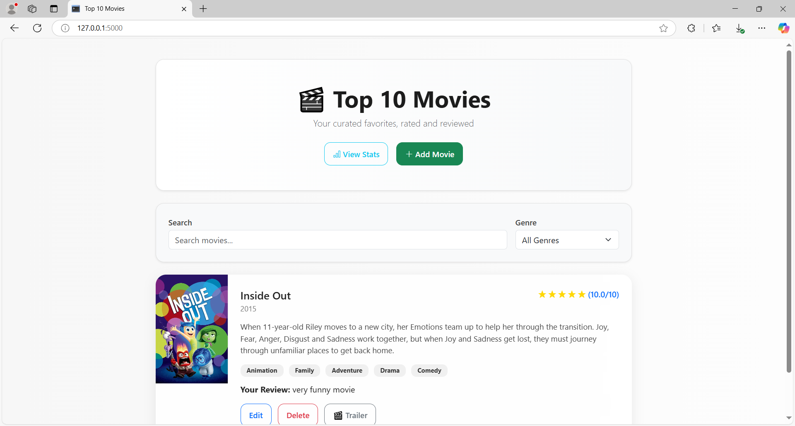
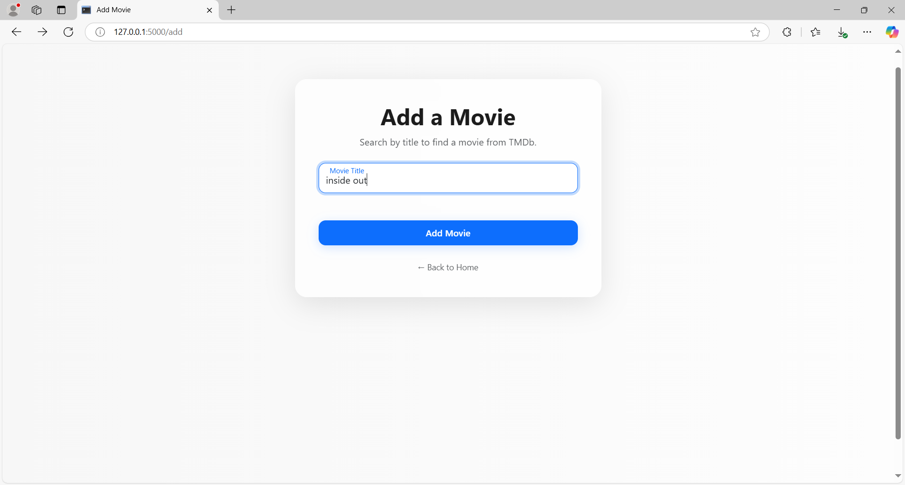
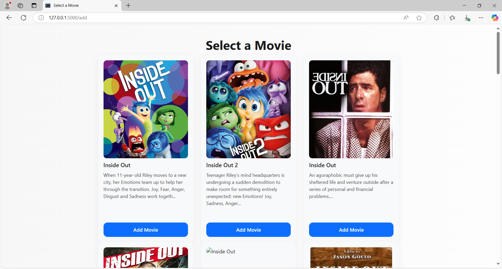
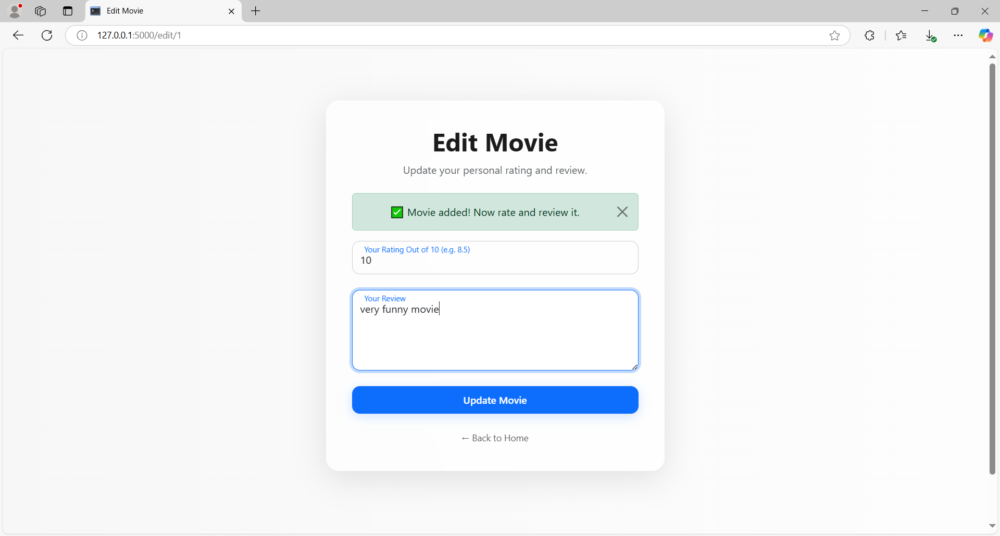
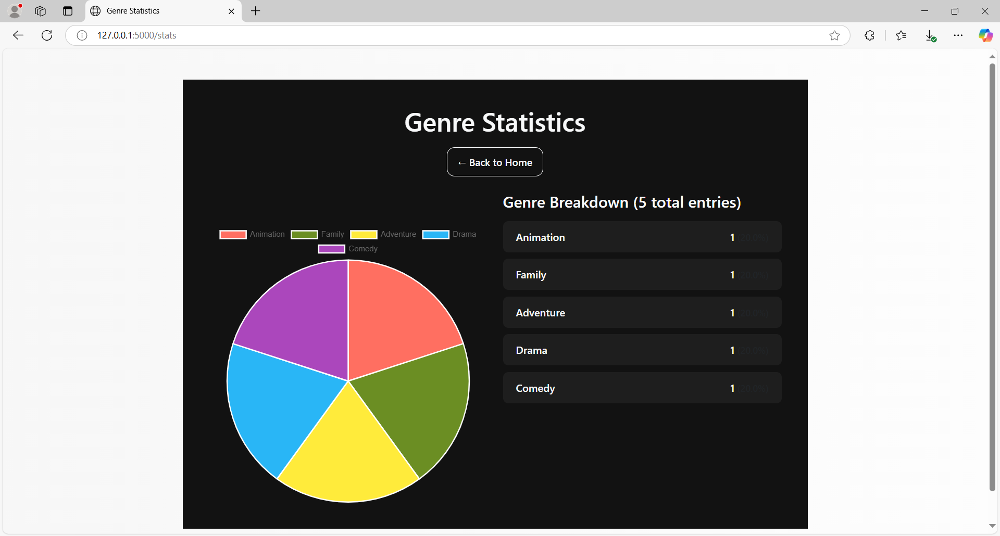

# 🎬 Top 10 Movies Web App

A beautifully polished full-stack Flask web application for curating and reviewing your top 10 favorite movies. This is a fully upgraded and deployed version of my original CLI-based movie tracker.

> 🔗 **Original Version:** [View CLI Version on GitHub](https://github.com/Cyber-Security-Tech/top10-movies)

---

## 📽️ Demo

  
🌐 **Live Site:** [https://top10-movies-web.onrender.com](https://top10-movies-web.onrender.com)

---

## 🌟 Features

- 🔍 Add movies by searching the **TMDb API**
- ✅ Select from real-time search results and auto-fill movie data
- 📝 **Rate and review** each movie with full form validation and feedback
- ✏️ Edit and ❌ delete movies instantly
- 🎯 Filter movies by **genre** or **search keyword**
- ⭐ Dynamic **star-based rating system** (out of 5)
- 🏷️ Clickable genre badges for quick homepage filtering
- 📊 View **genre statistics** using an animated **Chart.js** pie chart
- 💡 Flash messages for all user actions with built-in error handling

---

## ⚙️ Tech Stack

- **Frontend:** HTML, CSS, Bootstrap 5, Chart.js
- **Backend:** Python, Flask, Jinja2, Flask-WTF, Flask-SQLAlchemy
- **APIs:** [TMDb API](https://www.themoviedb.org/documentation/api), YouTube Data API
- **Deployment:** Render
- **Other:** SQLite3, .env configuration, GitHub Actions (CI-ready)

---

## 🧠 What I Learned

- Building secure and scalable Flask applications using Blueprints and app factories  
- Using `Flask-WTF` for form handling and validation with CSRF protection  
- Consuming external APIs and mapping API data to SQLAlchemy models  
- Managing dynamic search + filtering UI flows with query parameters  
- Working with SQLite3 databases and ORM relationships  
- Structuring professional project directories with reusable templates  
- Deploying full Flask apps with environment configs on **Render**

---

## 🖼️ Screenshots

| Page           | Preview |
|----------------|---------|
| **Home**       |  |
| **Add Movie**  |  |
| **Select Movie** |  |
| **Edit Movie** |  |
| **Stats Page** |  |

---

## 📁 Project Structure

```
top10-movies-web/
├── app/
│   ├── __init__.py
│   ├── routes.py
│   ├── models.py
│   ├── forms.py
│   ├── utils.py
│   ├── templates/
│   └── static/
│       ├── css/
│       └── media/
├── instance/
│   └── movies.db  # (Local only - ignored by Git)
├── .env
├── requirements.txt
├── run.py
└── README.md
```

---

## 🚀 How to Run Locally

1. **Clone the repository**
```bash
git clone https://github.com/Cyber-Security-Tech/top10-movies-web.git
cd top10-movies-web
```

2. **Create a virtual environment and install dependencies**
```bash
python -m venv venv
source venv/bin/activate  # On Windows: venv\Scripts\activate
pip install -r requirements.txt
```

3. **Create a `.env` file**
```
SECRET_KEY=your_secret_key_here
TMDB_API_KEY=your_tmdb_api_key
YOUTUBE_API_KEY=your_youtube_api_key
```

- 🔑 You can generate a `SECRET_KEY` in Python:
```python
import secrets; print(secrets.token_hex(16))
```

- 📦 [TMDb API Key](https://www.themoviedb.org/documentation/api) – Create a free account and generate an API key.
- 📺 [YouTube API Key](https://console.cloud.google.com/apis) – Enable the **YouTube Data API v3** and create credentials.

4. **Run the app**
```bash
python run.py
```

---

## 🔮 Future Improvements

- ✅ User authentication (login/signup) and personal movie lists  
- 🌐 Pagination for large movie collections  
- 🧠 Smarter trailer search with fallback logic and AI recommendations  
- 🎨 Light/dark mode toggle and full mobile responsiveness  
- ☁️ Admin dashboard and CRUD interface for moderation

---
